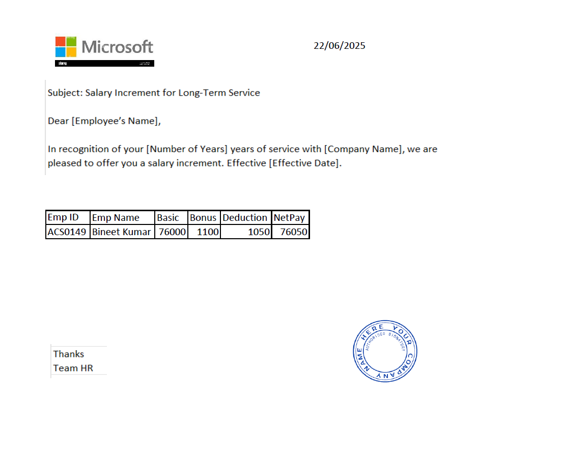
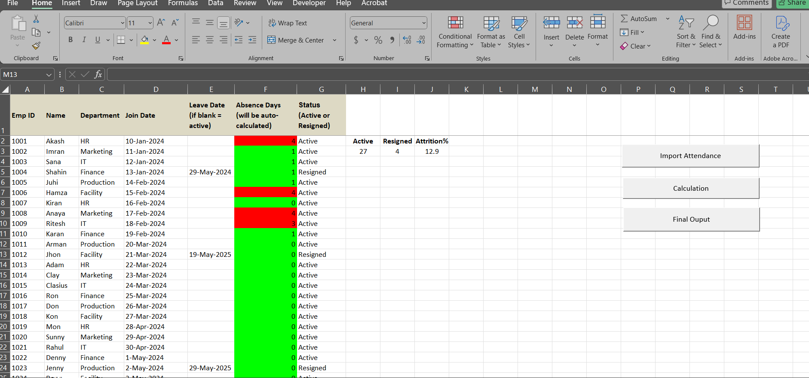

# VBA HR Automation – Payroll & Attendance Tools

## Project Overview

This repository contains two Excel VBA automation tools designed to reduce manual HR effort:

1. ## Salary Increment PDF Generator** – Automatically generates individual PDF letters for each employee with increment details.
2. ## Attendance & Attrition Analyzer** – Imports monthly attendance data, calculates absenteeism, flags employees with excessive absences, and computes attrition rate.

 ## Tools:
- Microsoft Excel
- VBA (Visual Basic for Applications)
- FileSystemObject
- Excel Automation (AutoFilter, PasteSpecial, PDF Export)

## Project Files:

- [Salary_increment_letter_generator](VBA_Salary_Increment_Letter_Generator.txt)
- [Attrition_Analysys.txt](vba_attendance_attrition_calc.txt.txt)

  ## Screenshots:

### Salary Increment PDF Generator:
- Filters and copies salary data per employee
- Calculates net pay
- Exports individual PDF files named by Emp ID
- Auto-generates and saves to a specified folder

### Attendance & Attrition Analyzer:
- File picker to import raw attendance dump
- Flags employees based on absentee count (>2 = Red, ≤2 = Green)
- Categorizes status as Active/Resigned based on exit date
- Displays active/resigned count and attrition % on dashboard

## Author
**Imran K.**  
Excel + VBA + SQL + Power BI  
[LinkedIn](#www.linkedin.com/in/imran-khan-aa8b4718b) | [GitHub](https://github.com/yourusername)

